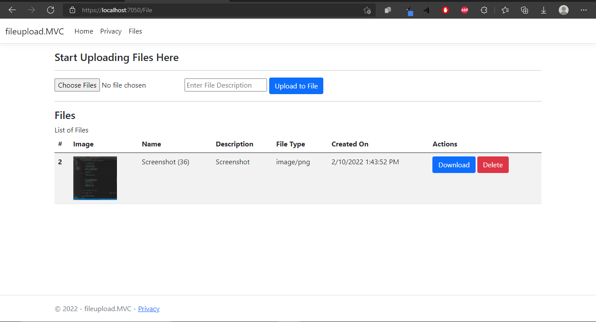

# FILEUPLOAD Asp.net Core MVC 6 web application

## Description

File upload web app built using C# asp.net core mvc 6, bootstrap and sqlite. Visitors can add, download and delete files. Files are only uploaded to file system, not in database.

## Features

- Upload file
- Download File
- Delete File

## Documentation

### Run Project

- Make sure you have dotnet ef core cli
- .Net 6 cli required
- run dotnet restore to install required packages
- run dotnet ef migrations add --context FileDbContext -o Data/Migrations
- run dotnet ef database update --context FileDbContext
- finally, dotnet run

### Frontend View

